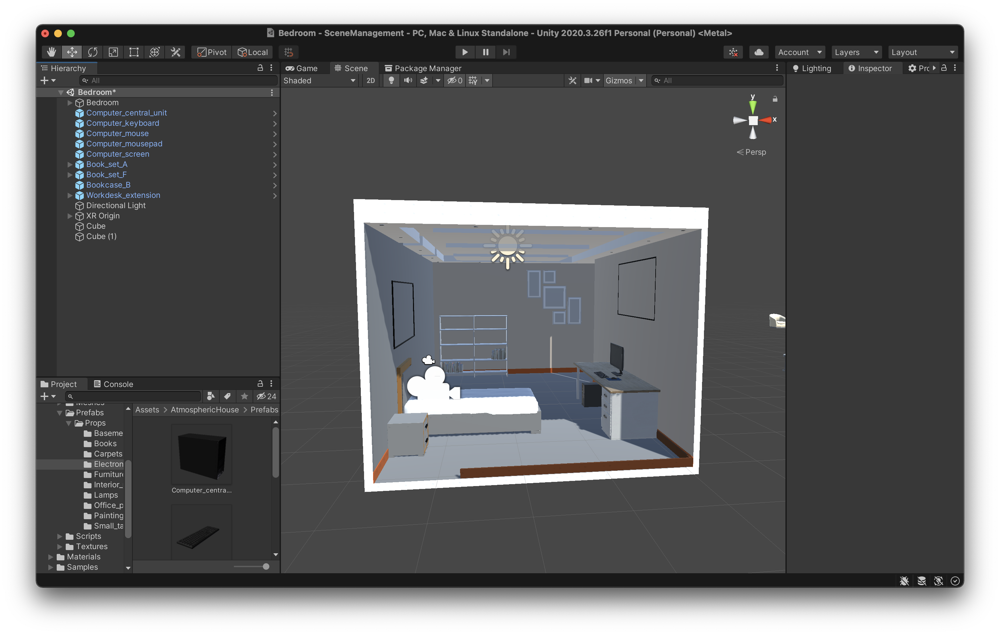
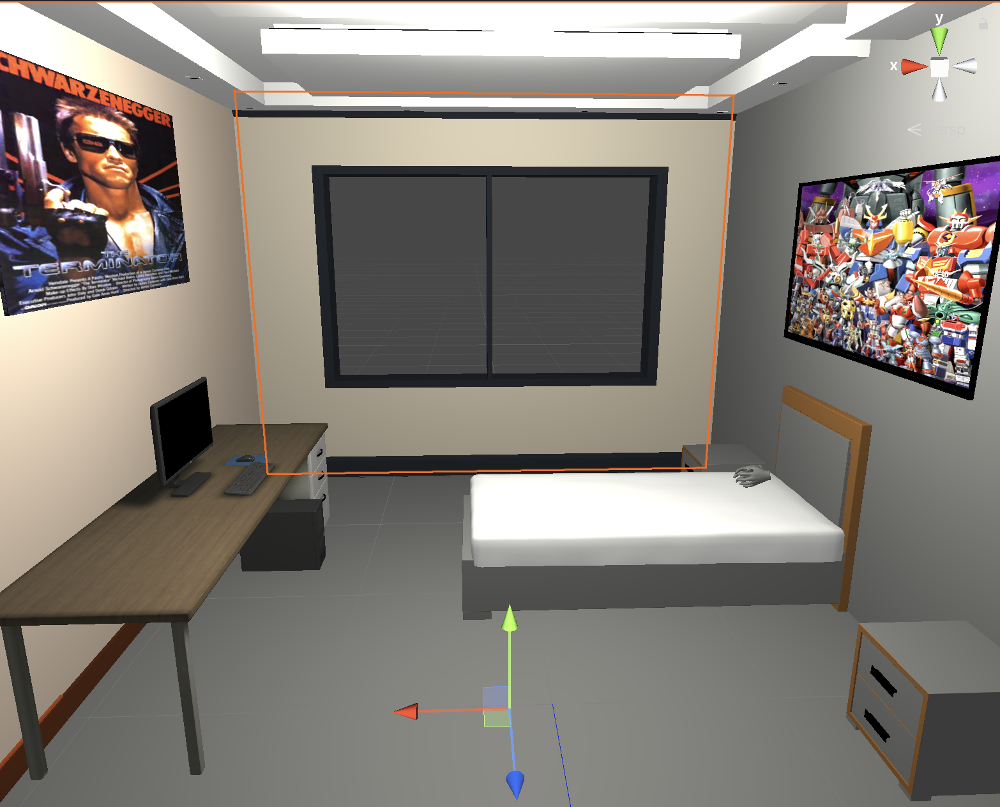
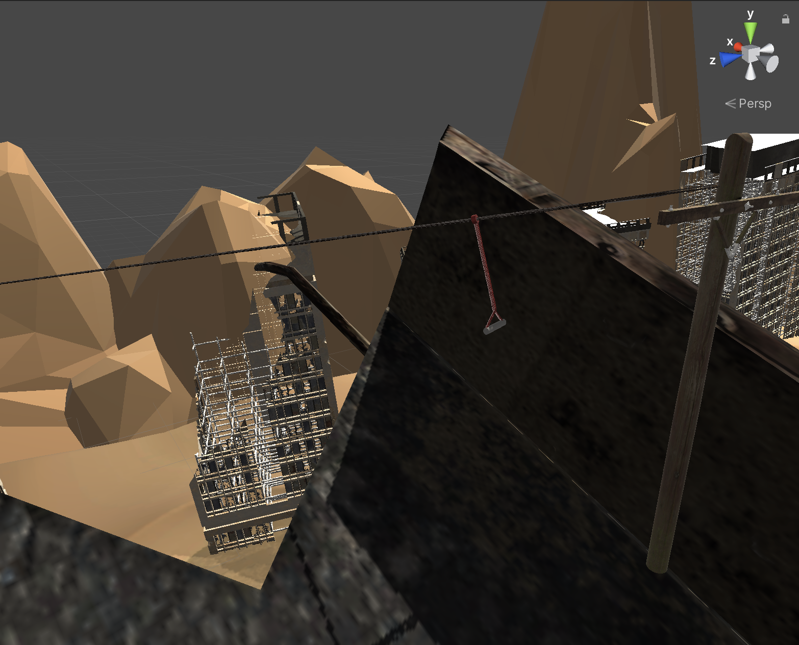
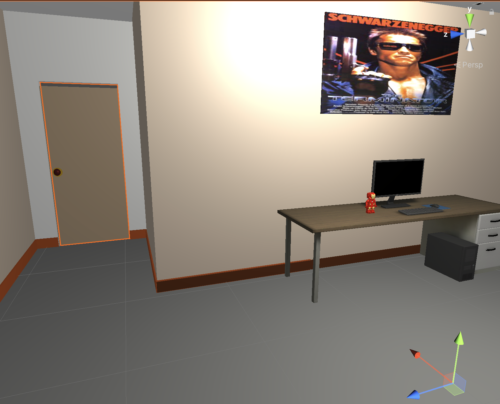
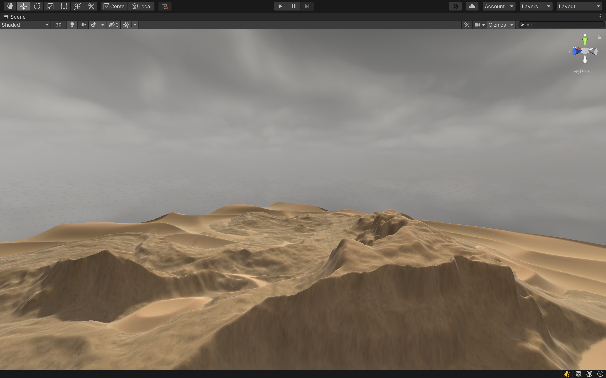
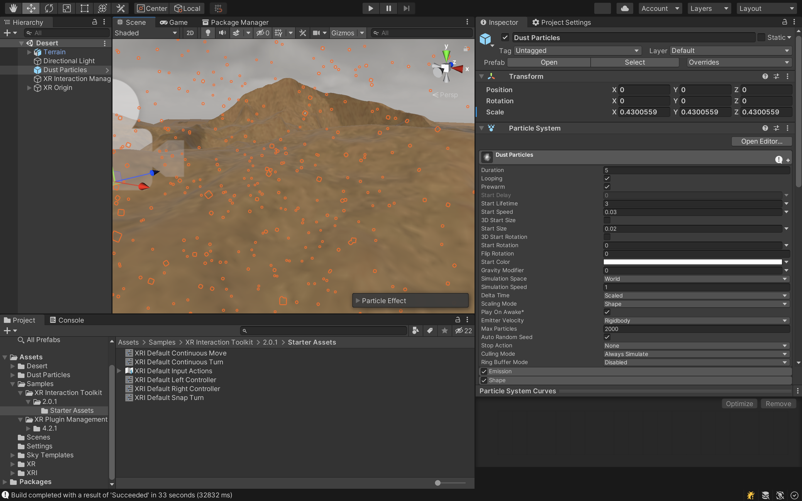
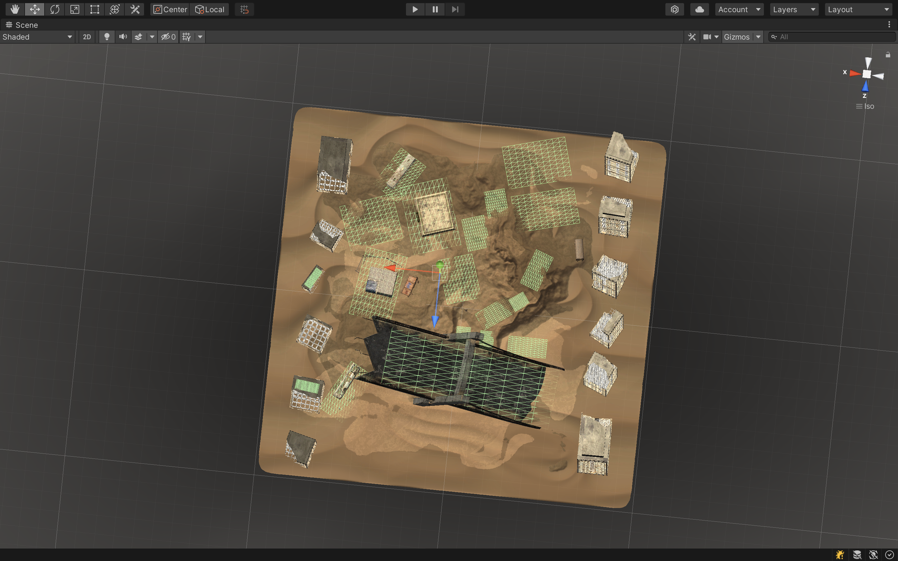

# The Blaze Ordeal

## Theme
The experience is a depiction of the future state of the world due to global warming should humans not change their action. The themes for the project are social issue, future outlook, and apocalyptic visuals.

## Plot
The story is about a teenager who goes to sleep and dreams [or has a nightmare] about the future where he finds himself in a post-apocalyptic world that is in ruins. He is guided by a robot to survive and reach civilization. The experience will take 5 mins, if the user does not survive by the end of the 5 mins, he returns to the bedroom where he can watch the news on the computer. 

## Worldbuilding 

## Process

Sashank 

I started working on the teenage bedroom scene added the elements to give it a look of a teenages bedroom like action figures, posters etc. I added teleportation in the teenager's bedroom and added the XR Scene. And also linked the separate XR scene to each of our scenes.Additionally,  I worked on finalizing the transition to the video scene (final scene). 




I merged the separate scenes each of us were working on. I worked on lights and video on the final bedroom scene. I also worked on player transportation in the scene, persistence video to the final scene and also worked on changing the scene based on a timer.

Checked all the scenes were correctly connected and had a smooth transition, fixed the XR transitions. For the bedroom apocalypse scene, I added interaction on the door to transition to the desert scene. In the desert scene, with help of the professor, I added the zip line which had two different outcomes; based on whether the user holds on to the zip line or leaves it midway. I was also able to fix the code for the NPC (Robot). For the final scene, I added ray interaction to the screen so that the video only plays if the player looks at the screen.





Yahia
In this project, my main role is to set the outside scene in which most of the activities of our game will take place. I built the scene using some assets online and many changes of my own. I then set the sky to be very cloudy to enhance the mood of mystery and post-apocalyptic scenes. I implemented a dusty wind effect in the scene to give a sense of isolation and to make it really feel like a desert.


I added a robot character that guides the user. Initially, I implemented some animations for it such as flying, turning to the sides, and moving backwards. I programmed it so that it dances when it reaches a certain house in the desert. I was not able to find actual flying animations so I tried using crawling motion instead. However, after testing it out it looked very awkward so I decided to make it walk instead.

I finalize the worldbuilding by adding proper teleportation planes all across the terrain and by ensuring all the game objects are of reasonable scale and exist in locations which make sense. This took all of time to test and to fit in the story we were trying to tell.



I also worked with Sashank on making the transitions between the scenes work properly by debugging several errors that have to do with the XR Origin and making an automatic transition to the bedroom scene after a certain amount of time has passed.

I also recorded the audio clips of dialogue between the robot and the player wearing the headset where the robot introduces itself and reassures the player that it is only there to help him survive, and instructs him to fetch a gun and then head to the zipline. I added a chair to the abandoned shop in hopes that our group would be able to implement a fighting interaction between the player and some robots, where an interactable gun should be on the chair and the player should find it and then use it overcome these robots so he can reach the zipline.

## Codes

**Code for Zip Line**
```C#

public class ZipLineScript : MonoBehaviour
{
    public Transform finish;
    public float speed = 0.0005f;
    public float fallSpeed = 1.0f;
    public AudioClip clip;

    public AudioSource smashSound;

    private XROrigin origin;
    private Vector3 start;
    private float lerping = 0;
    private Coroutine zipline;
    

    private void Start()
    {
        origin = FindObjectOfType<XROrigin>();
        smashSound = FindObjectOfType<AudioSource>();
    }

    public void Zipline_Activate()
    {
        lerping = 0;
        start = origin.transform.position;
        zipline = StartCoroutine(DoZip());
    }

     

    public void CancelZip()
    {
        StopCoroutine(zipline);
        StartCoroutine(Fall());
        


    }
    IEnumerator Fall()
    {
        //if (!source.isPlaying)
        //{
        //    source.Play();
        //}
        Vector3 fall = origin.transform.position;
        fall.y -= 20.0f;
        while (!Mathf.Approximately(origin.transform.position.y, fall.y))
        {
            lerping = Mathf.MoveTowards(lerping, 1.0f, fallSpeed * Time.deltaTime);
            origin.transform.position = Vector3.Lerp(start, fall, lerping);
            yield return null;
        }
        XRSceneTransitionManager.Instance.TransitionTo("Bedroom");
    }

    IEnumerator DoZip()
    {
        yield return new WaitForSeconds(.25f);

        while (!Mathf.Approximately(Vector3.Distance(origin.transform.position, finish.transform.position), 0))
        {
            lerping = Mathf.MoveTowards(lerping, 1.0f, speed * Time.deltaTime);
            origin.transform.position = Vector3.Lerp(start, finish.transform.position, lerping);
            yield return null;
        }

        if (Mathf.Approximately(Vector3.Distance(origin.transform.position, finish.transform.position), 0))
        {
            smashSound.Play();
            yield return new WaitForSeconds(smashSound.clip.length);
            XRSceneTransitionManager.Instance.TransitionTo("Bedroom");
        }
        
    }

}

```

**Code to load the final scene and play video in the screen**

``` C#

    private void Update()
    {
        if (!allowTransition) return;

        timeElapsed += Time.deltaTime;
        string active = SceneManager.GetActiveScene().name;
        if (active == sceneNameToLoad)
        {
            return;
        }
        if (timeElapsed > delayBeforeLoading)
        {
            //Vector3 newScale = new Vector3(0.207f, 0, 0.205f);
            //float speed = 2.0f;

            if (!hasTransitioned)
            {
                XRSceneTransitionManager.Instance.TransitionTo(sceneNameToLoad);
                hasTransitioned = true;
            }
            //gameObject.transform.localScale = Vector3.Lerp(transform.localScale, newScale, speed * Time.deltaTime);
            gameObject.transform.localScale += new Vector3(0.007f, 0, 0.005f);
        }
    }

    public void Transfer()
    {
        if (gameObject.scene.name == toScene)
        {
            return;
        }
        if (transform.parent != null)
        {
            transform.SetParent(null);

        }
        Scene newScene = SceneManager.GetSceneByName(toScene);
        if (newScene.IsValid())
        {
            SceneManager.MoveGameObjectToScene(gameObject, newScene);
        }
```
**Code for Moving the Robot to Checkpoints**
```C#
// ClickToMove.cs
using UnityEngine;
using UnityEngine.AI;
//using UnityEngine.InputSystem;
using UnityEngine.SceneManagement;
using System.Linq;
using System.Collections;
using System.Collections.Generic;

public class MoveBot : MonoBehaviour
{
    public NavMeshAgent agent;

    //public GameObject[] checkPointList;
    public GameObject checkPoint1;
    public GameObject checkPoint2;
    public GameObject checkPoint3;
    public GameObject checkPoint4;
    public Vector3 targetPoint;
    public AudioSource robot1;
    public AudioSource player1;
    public AudioSource robot2;
    public AudioSource player2;
    public AudioSource robot3;


    //RaycastHit hitInfo = new RaycastHit();

    private void Start()
    {
        PlayerPrefsV.SetBool("checkPoint1Complete", false);
        PlayerPrefsV.SetBool("checkPoint2Complete", false);
        PlayerPrefsV.SetBool("checkPoint3Complete", false);
        PlayerPrefsV.SetBool("checkPoint4Complete", false);

        robot1= GetComponent<AudioSource>();
        player1= GetComponent<AudioSource>();
        robot2 = GetComponent<AudioSource>();
        player2 = GetComponent<AudioSource>();
        robot3 = GetComponent<AudioSource>();
}

    void Update()
    {
        //StartCoroutine(TraverseCheckpoints());

        if (PlayerPrefsV.GetBool("checkPoint1Complete", true) && PlayerPrefsV.GetBool("checkPoint2Complete", true)
            && PlayerPrefsV.GetBool("checkPoint3Complete", true) && PlayerPrefsV.GetBool("checkPoint4Complete", true))
        {
            StopCoroutine(SetCheckpoint(checkPoint4));
            StartCoroutine(SetCheckpoint(checkPoint4));
        }
        else if (PlayerPrefsV.GetBool("checkPoint1Complete", true) && PlayerPrefsV.GetBool("checkPoint2Complete", true)
            && PlayerPrefsV.GetBool("checkPoint3Complete", true))
        {
            //targetPoint = checkPoint4.transform.position;
            StopCoroutine(SetCheckpoint(checkPoint3));
            StartCoroutine(SetCheckpoint(checkPoint4));
            //SetCheckpoint(checkPoint4);


        }
        else if (PlayerPrefsV.GetBool("checkPoint1Complete", true) && PlayerPrefsV.GetBool("checkPoint2Complete", true))
        {
            //targetPoint = checkPoint3.transform.position;
            StopCoroutine(SetCheckpoint(checkPoint2));
            StartCoroutine(SetCheckpoint(checkPoint3));
            //SetCheckpoint(checkPoint3);
        }
        else if (PlayerPrefsV.GetBool("checkPoint1Complete", true))
        {
            StopCoroutine(SetCheckpoint(checkPoint1));
            
            StartCoroutine(SetCheckpoint(checkPoint2));
            targetPoint = checkPoint2.transform.position;
            //SetCheckpoint(checkPoint2);
        }
        else
        {
            StartCoroutine(SetCheckpoint(checkPoint1));
            //targetPoint = checkPoint1.transform.position;
            //SetCheckpoint(checkPoint1);
        }


        //GameObject checkpoint_test = this.FindCheckpoint("BotCheckpoint");
        //agent.SetDestination(checkpoint_test.transform.position);
    }

    IEnumerator SetCheckpoint(GameObject check)
    {
        yield return new WaitForSeconds(2f);
        targetPoint = check.transform.position;
        //agent.SetDestination(targetPoint);
        string journeyName = check.tag.ToString() + "Complete";
        while (PlayerPrefsV.GetBool(journeyName) == false)
        {
            agent.SetDestination(targetPoint);
            yield return null;

        }
    }

    IEnumerator TraverseCheckpoints()
    {
        yield return new WaitForSeconds(2f);
        SetCheckpoint(checkPoint1);
        yield return new WaitForSeconds(1f);
        SetCheckpoint(checkPoint2);
        yield return new WaitForSeconds(1f);
        SetCheckpoint(checkPoint3);
        yield return new WaitForSeconds(1f);
        SetCheckpoint(checkPoint4);
        //yield return new WaitForSeconds(6f);
        yield return null;
    }
    private void OnTriggerEnter(Collider other)
    {
        if (other.gameObject.tag == "checkPoint1")
        {
            PlayerPrefsV.SetBool("checkPoint1Complete", true);
            //robot1.Play(0);
            Debug.Log("started");
            //player1.Play(0);
            Debug.Log("started");
            //robot2.Play(0);
            Debug.Log("started");
            //player2.Play(0);
            Debug.Log("started");
            //robot3.Play(0);
            Debug.Log("started");
        }
        else if (other.gameObject.tag == "checkPoint2")
        {
            PlayerPrefsV.SetBool("checkPoint2Complete", true);
        }
        else if (other.gameObject.tag == "checkPoint3")
        {
            PlayerPrefsV.SetBool("checkPoint3Complete", true);
        }
        else if (other.gameObject.tag == "checkPoint4")
        {
            PlayerPrefsV.SetBool("checkPoint4Complete", true);
        }
    }
}

```

**Code for Animating the Robot**
```C#
using System.Collections;
using System.Collections.Generic;
using UnityEngine;
using UnityEngine.AI;

public class VanguardController : MonoBehaviour
{
	Animator animator;
	NavMeshAgent agent;

	int isFlyingHash;
	int velocityXHash;
	int velocityZHash;

	private void Awake()
	{
		animator = GetComponent<Animator>();
		agent = GetComponent<NavMeshAgent>();

		isFlyingHash = Animator.StringToHash("isFlying");
		velocityXHash = Animator.StringToHash("velocityX");
		velocityZHash = Animator.StringToHash("velocityZ");
	}

	private void Update()
	{
		Vector3 velocity = agent.velocity;

		bool isFlying = velocity.magnitude > 0.01f && agent.remainingDistance > agent.radius;

		animator.SetBool(isFlyingHash, isFlying);

		velocity = transform.InverseTransformVector(velocity);
		//		transform.position += transform.forward * Time.deltaTime;
		animator.SetFloat(velocityXHash, velocity.x);
		animator.SetFloat(velocityZHash, velocity.z);

	}
}
```
## Challanges

Collaborating on the project was a challange. When working in the same scene, we had merge conflicts which slowed the progress of our experience. 

## Reflection and Next Steps

For future improvements, we have several things to do next:

- Add the shooting function which was being worked on by Aayush
- Fix the bug with the NPC
- Add more interaction and sound design to better tell the story
- Add a proper teleportation region in the desert scene
